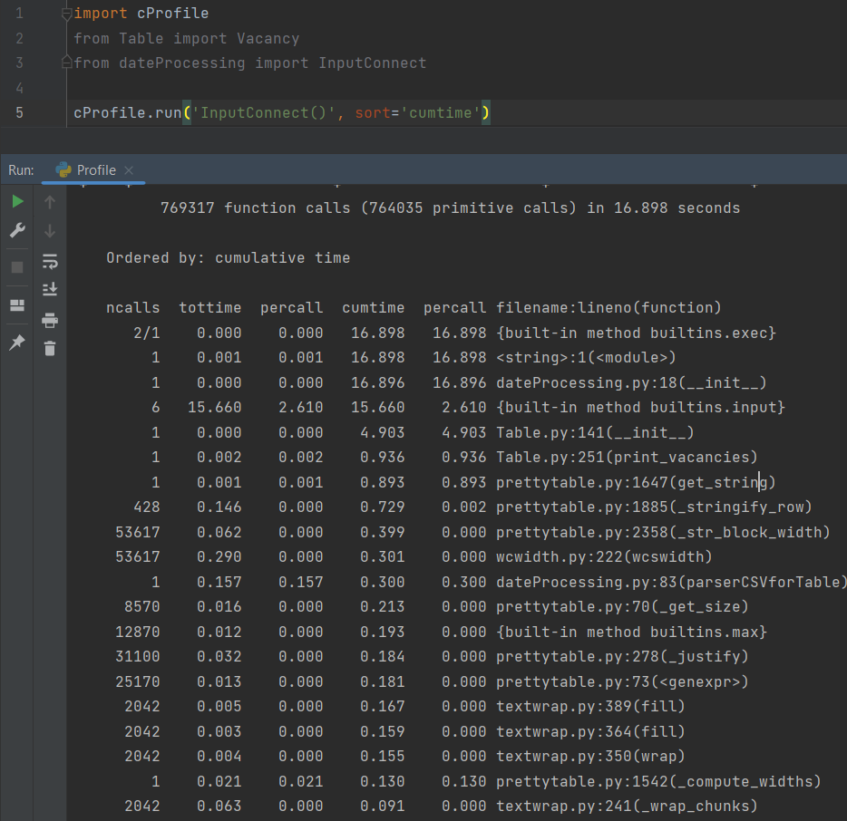
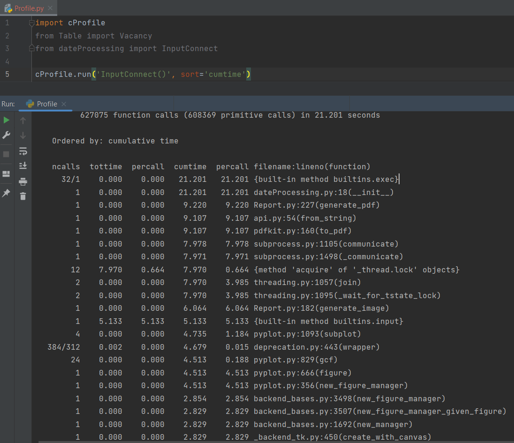
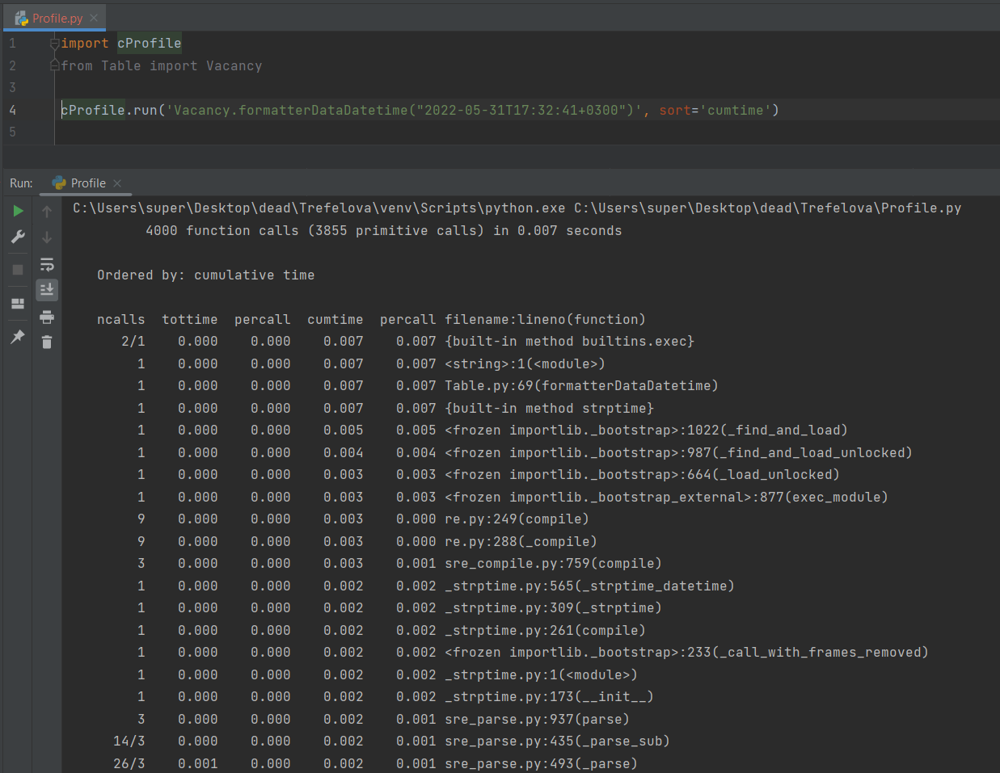
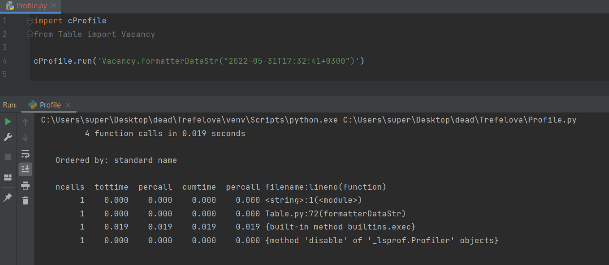
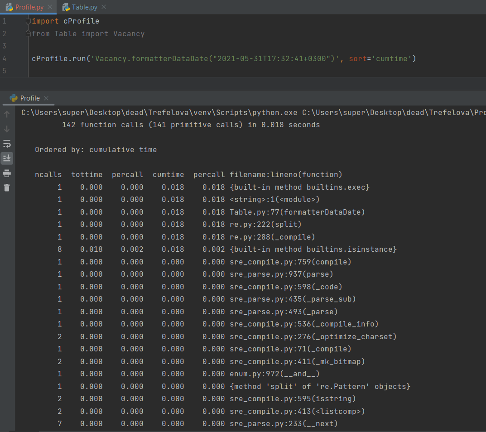
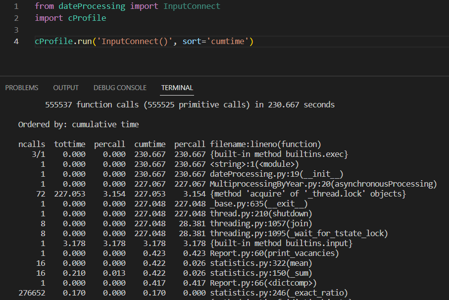
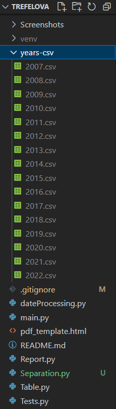

# Автор: Трефелова Алина

## Тестирование:

- Отчёт о тестировании на doctest

- Отчёт о тестировании на unittest

## Профилирование:
### Без многопроцессорной обработки

- При печати вакансий

- При генерации отчёта
(Здесь профилирование было с файлом vacancies_medium)

- При форматировании даты: 

Функция formatterDataDatetime

Функция formatterDataStr

Функция formatterDataRe (переименована)

### Concurrent futures

## Разделённые csv-файлы:

